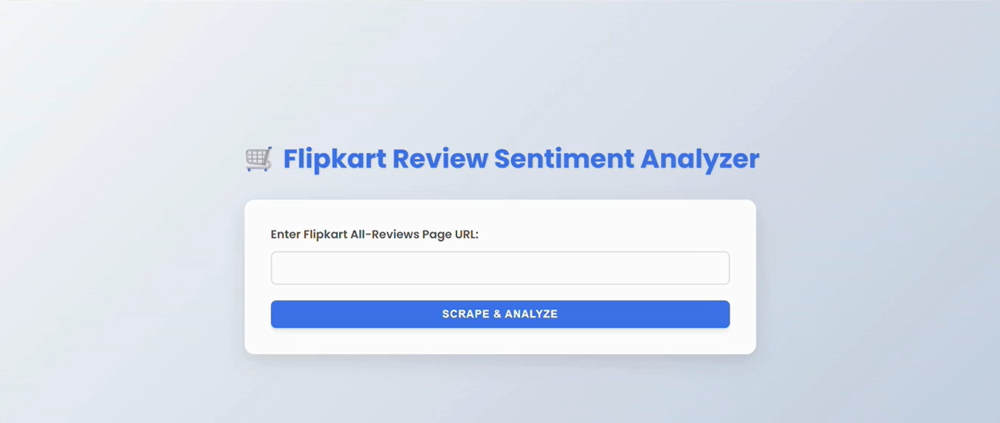
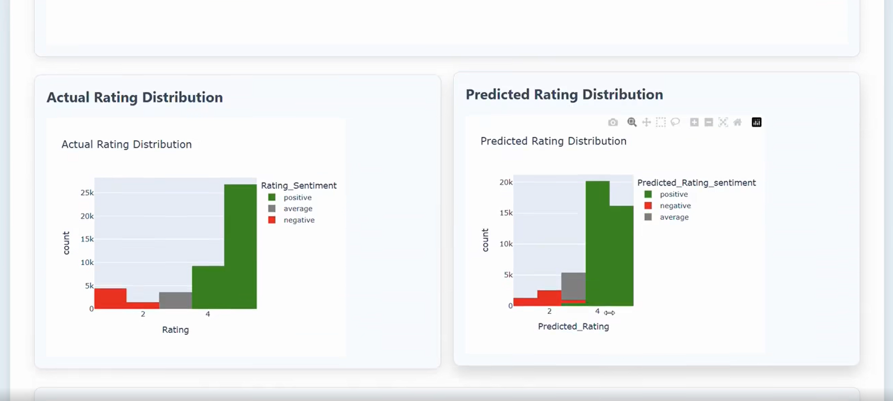
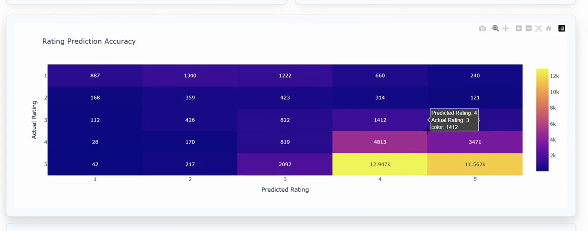
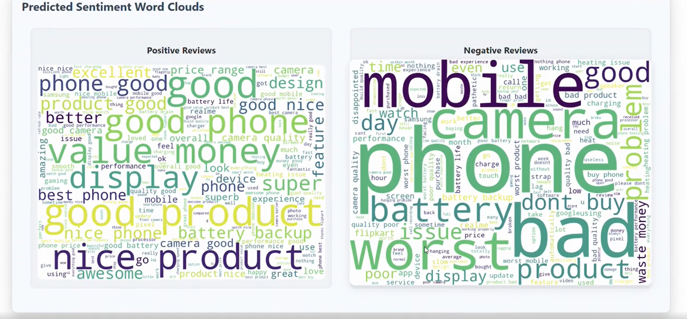

# 🛒 Sentiment Analysis for E-Commerce Product Reviews 
A complete NLP-based system that scrapes Flipkart product reviews using Playwright and analyzes sentiment with VADER. Features star-rating prediction, interactive visualizations, and a Flask web interface. Helps customers make better decisions and enables businesses to understand sentiment trends.
This project aims to analyze **customer sentiment** from Flipkart product reviews using **web scraping, NLP, and Flask-based deployment**. It predicts user satisfaction levels, visualizes sentiment trends, and helps both customers and businesses make informed decisions.

# 🎯 Objective  
To build an end-to-end system that:  
- Scrapes real customer reviews from **Flipkart**  
- Processes and analyzes sentiment using **NLP + VADER**  
- Predicts **star ratings** based on sentiment scores  
- Visualizes patterns through charts and word clouds  
- Provides an interactive **Flask web interface** for analysis

# 🧩 Key Features  
✅ Scrapes product reviews using **Playwright**  
✅ Cleans and preprocesses text using NLP techniques  
✅ Performs sentiment scoring using **VADER**  
✅ Predicts **1–5 star ratings** using custom rule-based mapping  
✅ Visualizes insights using **Plotly** & **Matplotlib**  
   - Pie chart of sentiment distribution  
   - Bar plots for rating frequency  
   - Confusion matrix for prediction accuracy  
   - Word clouds for positive/negative words
     
✅ Simple and clean **Flask web app** for user interaction  
✅ Helps both customers & companies understand product sentiment

# 🛠️ Tech Stack  
- **Python**  
- **Playwright** — Web scraping  
- **Pandas, NumPy** — Data handling  
- **NLTK VADER** — Sentiment analysis  
- **Plotly, Matplotlib, WordCloud** — Visualizations  
- **Flask** — Web application

## 📥 How It Works

### 1️⃣ Web Scraping  
Playwright fetches multiple pages of Flipkart reviews:  
- Username  
- Rating  
- Review title & text  
- Timestamp  

### 2️⃣ Sentiment Processing  
Text is cleaned and passed through **VADER** for polarity scoring:  
- Positive  
- Negative  
- Neutral  
- Compound Score  

### 3️⃣ Rating Prediction  
A custom rule-based approach maps sentiment → star rating:  
- Compound < -0.3 → ⭐  
- -0.3 to 0.0 → ⭐⭐  
- 0.0 to 0.3 → ⭐⭐⭐  
- 0.3 to 0.6 → ⭐⭐⭐⭐  
- > 0.6 → ⭐⭐⭐⭐⭐

### 4️⃣ Visualization  
Interactive dashboards display:  
- Sentiment pie chart  
- Actual vs Predicted bar graph  
- Confusion matrix  
- Word clouds  

### 5️⃣ Flask Interface  
A simple UI to:  
- Input product link  
- Trigger scraping  
- View sentiment insights  
- Download results

📊 Output Examples :

Sentiment Pie Chart:

Rating Predictions :

Confusion Matrix :

Word Cloud :

Top 20 Keywords :

🌟 Applications

👤 For Customers
- Helps understand overall product sentiment
- Quick overview of pros/cons
- Reduces decision time

🏢 For Companies
- Detects product improvement areas
- Tracks user satisfaction trends
- Helps in competitive analysis

👨‍💻 Team Members
- Atharva Patil
- Mehul Chavan
- Pratik Chinchawadkar
- and myself : Ajinkya Bondge 
